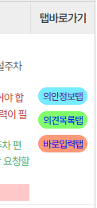
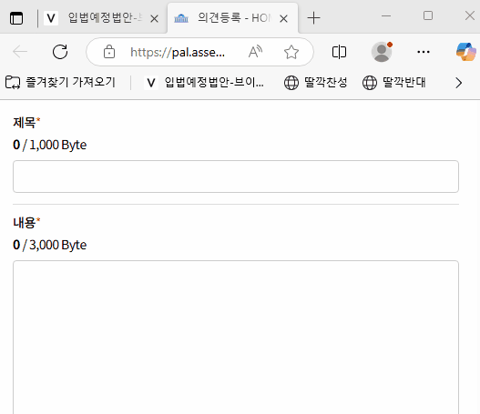

# 철학

190마리가 10명씩 팀짜서 법안 하나씩 싸재끼면 19개의 법안이 싸짐.

이걸 하루에 10번 하면 190개의 법안이 싸짐.

이것을 반대하려면 1명당 190개의 법안 반대 하는것을 1만명이 해야함.

누가 사기치는걸까?

### 데모

약 40초 짜리 GIF 있음. 로딩중이면 안보임. 조금만 기다려주세요

(GIF 영상 시작)


로딩이 안되면 이 `./readme-source/메인데모.gif`에서 직접 봐주세요

(GIF 영상 끝)

'의견등록패치 체크' + 확장을 사용한 반자동화

N개의 법안이 모두 '의견등록' 페이지에 있을때, 그중에서 하나만 보안문자 입력 통과되면 나머지는 **공백이 아닌 모든 값**이 통과됨. 밑에 자세히 설명.

### 참고

**확장**: https://gall.dcinside.com/mgallery/board/view/?id=uspolitics&no=1331149

이 확장에 자동 등록만 추가한거라고 보면됨

**딸깎 북마클릿**: https://gall.dcinside.com/mgallery/board/view/?id=alliescon&no=3434125

제일 알잘딱. VFORKOREA와 국회입법예고 사이트 두곳에서 '북마클릿' 기능을 이용한 아주 센스 있는 솔루션.

이 폴더의 파일들은 그냥 딸깎좌의 방법을 풀어서 모듈화(?) 했다고 보면됨.

**VFORKOREA**: https://vforkorea.com/assem/

입법예정법안과 그것들의 내용을 AI요약해준 사이트. 

**국회입법예고 사이트**: https://pal.assembly.go.kr/napal/main/main.do

여기서 휴대폰 인증만 하면 회원가입 끝. 이 아이디로 입법참여와 국민청원 가능

# VFORKOREA

  * 의견등록패치.js
  * 의견등록패치 체크.js

아래는 기본동작 데모.


기본동작: 마우스 중간 클릭시 탭에 '제안 이유및 주요내용'이 뜸. "의견 등록"을 한번 더 클릭해야 해서 귀찮음

아래는 '의견등록패치' 사용시 데모:


'의견등록패치'후: 마우스 중간 클릭하면 '의견등록' 페이지로 바로가짐

아래는 '의견등록패치 체크' 사용시 데모:


'의견등록패치 체크'후: 마우스 중간 클릭시 '확인 체크'도 자동으로 해줌

아래는 북마클릿 만드는법:


1. 코드 복사 (Ctrl + c 혹은 우클릭릭
2. 북마크바에 우클릭후 붙혀넣기. 북마크바 안보이면 (Ctrl + B) 누르면 나타남
3. "javascript:(function" 돼있는거 우클릭 -> 편집으로 이름 바꿔주기
4. 북마크 좌클릭(기본클릭)해서 사용

밑에 '딸깍 북마클릿' 사용시 법률안 탭에 열때 체크해주는 기능 있지만, 개인적으로 프롬트 싫어함.

내가 건의하여 중간 마우스 클릭으로 '의견등록' 페이지로 바로 가게 하는 버튼 추가됐지만, 클릭시 '체크'까지 해주는 버튼도 추가해달라고 요청하기에 운영자가 부담 될수도 있을것 같음.

'의견등록패치 체크' 사용시 링크 클릭시 체크가 자동으로 됨.



건의 게시글: https://vforkorea.com/com/apply/22

결국 요청 계속 하다가 "꼬우면 니가 만들던가"라는 소리 들으면 그 다음 가장 쉬운 방법은 이 웹사이트를 스크래이핑 하게 될것 같은데. 이렇게 될 바에는 차라리 *법률안 응답받고 AI 설명 추가하는 코드좀 공유해주면* 좋을듯.

이렇게 되면 개발자들 각자의 웹사이트에서 본인들이 필요하다고 생각하는 기능 추가, GUI 및 레이아웃 업그레이드 등으로 그중 제일 나은 웹사이트가 이 경쟁에서 승리하며 가장 유용할것 같음.

하지만 이 웹사이트는 선두자로써, 같은 목적을 갖은 사람들이 제일 먼저 모인 **커뮤니티로써의 가치가 뛰어나보임**.

# 입법 의견등록 보안문자

일단 '의견등록'을 쉽게 만들어주는 것이 N개의 법안이 모두 '의견등록' 페이지에 있을때, 그중에서 **하나만 보안문자 입력 통과되면** 나머지는 **공백이 아닌 모든 값**이 통과됨.

※ 위에 데모 참고

그래서:

1. 법률안-1 ~ 법률안-20 모두 순차적으로 탭에 열어두면, 일단 법률안-1~19는 보안문자를 정확히 입력해도 일치하지 않는다고 함. 그래서 "새로고침"을 눌러주고 입력해야 통과됨.

2. 마지막으로 열린 법률안-20만이 새로고침 없이 입력해도 통과됨.

아무튼 이 둘중 한 방법으로 보안문자가 통과된 의견등록이 성공됐다면, 나머지는 보안문자에 1111, 12345, 1, ㅗ 이런 **공백이 아닌 모든 값**이 모두 통과됨.

이것은 '의견등록패치'를 했건, 수동으로 "제안 이유 및 주요내용"이나 "의견목록" 페이지에서 "의견등록" 클릭해서 넘어가건 똑같음. 열어툰 법률안 '의견등록' 페이지에서 하나만 통과하면 됨.

# 입법 의견등록 자동화 - 북마클릿

  * 딸깍반대.js
  * 딸깍찬성.js

아래는 딸깍찬성 데모:



'중복 방지 문자가 일치하지 않습니다.'는 위에 말한 N개 열어서 하나 통과 시킨게 아니라 하나 열어서 자동 등록 시킨것.

하지만 앞서 말했듯이 N개 법안의 '의견등록'이 열려있을때, 마지막 법안만 '중복 방지 문자'가 통과되고, 딴 애들은 중복방지문자의 '새로고침' 버튼 한번 눌러줘야함.


"의견을 등록하시겠습니까?" 나왔을때 취소나 ESC 누르고 '중복 방지 문자' 고쳐써도됨

무슨 이유에서든지 클릭했을때 자동 등록 하기 싫다면 '딸깍반대'와 '딸깍찬성'파일 각 코드마다 마지막 줄에 있는

```
submit_click()
```

지워주고 북마클릿 등록하면됨.

'딸깍 북마클릿' 참고함. 보안문자 5글자 되면 자동으로 제출되는 기능 포함

# 입법 의견등록 자동화 - 확장 (제일 빠름)

  * 확장 입법참여 자동 반대
  * 확장 입법참여 자동 찬성

※ 위에 데모가 확장 사용한 데모

"딸깍반대", "딸깍찬성" 북마클릿 클릭할 필요 없이 '의견등록 페이지'에 *포커스*시 (해당 탭으로 이동시) 자동으로 제목, 내용, 보안문자 입력하고, 등록까지 눌러줌.

위에서 언급했듯이, 보안문자 하나 통과 된 상황이라면 나머지는 탭 이동후 "의견을 등록하시겠습니까?" 확인 클릭, 혹은 엔터/스페이스바 이후 "정상적으로 등록되었습니다"는 '확인'누를 필요 없음. 그래서 그냥 `탭이동 (ctrl + page down) -> 엔터/스페이스바 -> 연속`으로 탭 모두 이동하면 끝.

귀찮게 하나의 확장 프로그램에 반대/찬성 선택하는 기능보다 그냥:

  * 반대 할때는 반대 확장 활성화, 찬성 확장 비활성화
  * 찬성 할때는 찬성 확장 활성화, 반대 확장 비활성화

하는게 개발자도, 이용자도 윈윈임

다만 비개발자들의 경우에는 "내가 이해하지도 못하는 코드를 내 브라우저에 직접 설치해야돼?" 하면서 꺼려할수 있지만, 파일도 2개, 그중에 1개는 모든 확장 프로그램은 꼭 필요한 manifest.json이고 나머지 하나도 그냥 읽어보면 대충 이해됨.

# 확장 사용하는법

1단계:


엣지 브라우저 기준 프로필 아이콘 옆 '···' 표시 클릭후 '확장' 메뉴 클릭

2단계:


저런거 뜨면 '확장 관리' 클릭

3단계:


이것이 확장 관리 페이지

4단계:


개발자 모드 클릭하여 활성화 시켜주기

5단계:


그러면 저렇게 '압축 풀린 파일 로드' 이런게 추가됨

그리고 그거 클릭

6단계:


확장 폴더 찾아내기. 이 프로젝트 폴더 전체를 다운 받았다면, 이 폴더로 이동

7단계:


"확장 입법참여 자동 반대"폴더 들어가면 이렇게 비어보이는 폴더가 뜸. 여기에 파일 있는데, 저 창이 파일은 안보이게 해놔서 안보임. 저 폴더안에 'manifest.json'이 있어야 로드됨.

'폴더 선택' 클릭 해서 확장 로드 하기.

8단계:


그러면 이렇게 '설치된 확장'에 추가됨.

9단계:


"확장 입법참여 자동 찬성"도 추가해주기

10단계:


반대 운동시 '입법참여 자동 찬성' 비활성화하고 '입법참여 자동 반대' 활성화

11단계:


찬성 운동성 '입법참여 자동 반대' 비활성화하고 '입법참여 자동 찬성' 활성화

# 마무리

문제등 있으며 issue 남기기?